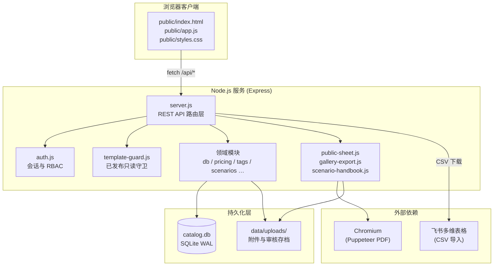
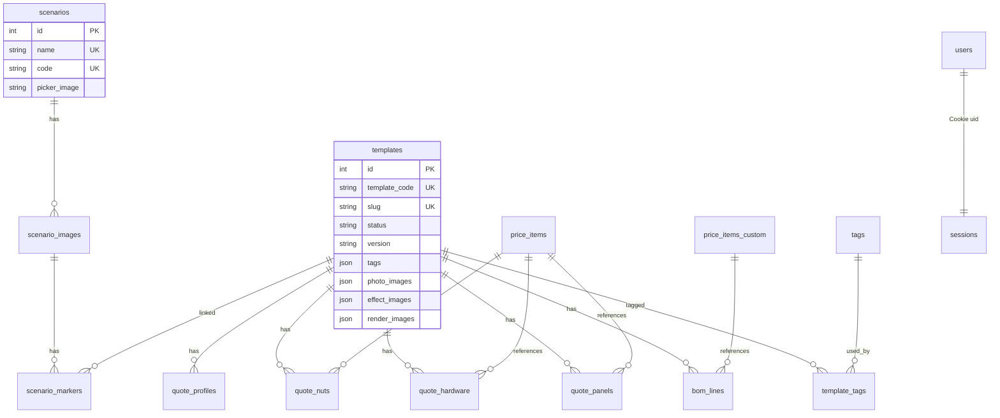
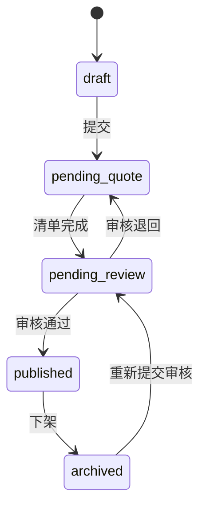
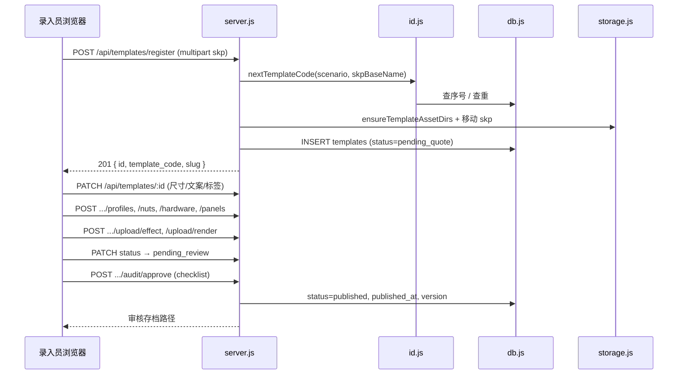
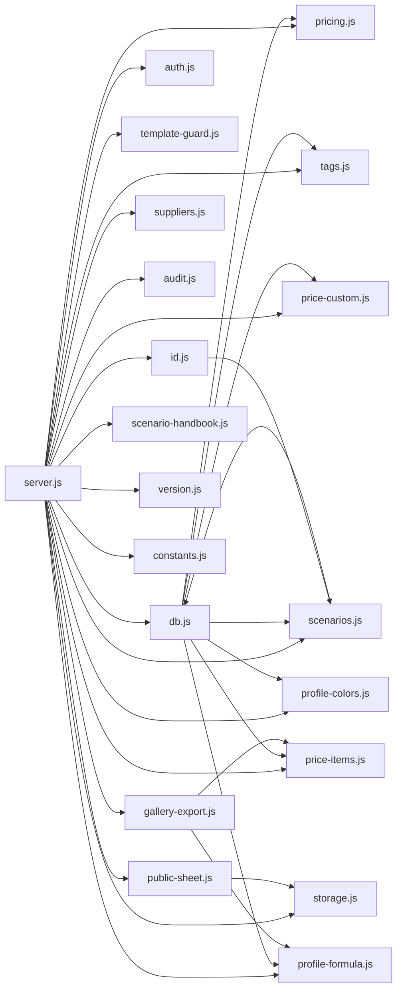

# MR2525 方案模板库 — 系统架构

> 版本：基于代码库 2026-06 快照  
> 适用对象：开发维护、部署运维、二次集成

---

## 1. 系统定位

**MR2525 方案模板库**（`mr2525-template-catalog`）是一套面向团队内部协作的 **SketchUp 方案模板管理系统**，核心能力包括：

| 能力域 | 说明 |
|--------|------|
| 模板录入 | 上传 `.skp`，自动生成 `TPL-{场景}-{序号}-{文件名}` 编号与 slug |
| 协作工作流 | 草稿 → 待清单深化 → 待审核 → 已发布 → 已下架，状态机约束推进 |
| BOM 与报价 | 型材 / 六通 / 五金 / 板材 / 非标件分项清单，自动计算参考价区间 |
| 场景与标签 | 场景库可视化标记、标签字云、多标签交集筛选 |
| 对外输出 | 模板图册 PNG、方案手册 PDF（脱敏）、内部清单 CSV、飞书 CSV 导出 |

**设计原则：**

- **单体应用**：Express 后端 + 原生 JS SPA 前端，无构建步骤，便于局域网/NAS 部署
- **本地优先**：SQLite + 文件系统存储，可放在 Nutstore 同步盘
- **飞书协同**：本地为主库，CSV 导出同步至飞书多维表格（非实时双向同步）

---

## 2. 总体架构



### 2.1 技术栈

| 层级 | 技术 | 说明 |
|------|------|------|
| 运行时 | Node.js ≥ 18（推荐 22） | 启动参数 `--experimental-sqlite` |
| Web 框架 | Express 4.x | 单体 HTTP 服务，端口默认 **3847** |
| 数据库 | Node.js 内置 `DatabaseSync` (SQLite) | WAL 模式，`data/catalog.db` |
| 文件上传 | Multer | skp 最大 200MB，图片最大 30MB |
| PDF 生成 | puppeteer-core + Chromium | 方案手册、场景手册 |
| 前端 PNG | html2canvas（vendor 静态托管） | 模板图册客户端截图 |
| 容器化 | Docker + docker-compose | NAS 部署，挂载 `data/` |

### 2.2 目录结构

```
mr2525-template-catalog/
├── architecture.md         # 系统架构（本文档）
├── src/                    # 后端源码
│   ├── server.js           # 入口：路由注册、中间件、启动
│   ├── db.js               # SQLite 初始化、Schema 迁移、模板 CRUD 聚合
│   ├── auth.js             # 用户、会话 Cookie、RBAC
│   ├── constants.js        # 场景、状态机、审核清单、业务常量
│   ├── id.js               # 模板编号 / slug 生成
│   ├── version.js          # 版本号 bump（v1.0 → v1.1 / v2.0）
│   ├── template-guard.js   # 已发布模板编辑限制
│   ├── storage.js          # 附件目录、封面解析、图片同步
│   ├── pricing.js          # 报价汇总计算引擎
│   ├── profile-formula.js  # 型材公式参数
│   ├── profile-colors.js   # 型材颜色库
│   ├── price-items.js      # 单价库（六通/五金/板材）
│   ├── price-custom.js     # 非标件
│   ├── price-seed.js       # 单价库初始种子数据
│   ├── suppliers.js        # 供应商库
│   ├── tags.js             # 标签 CRUD、字云、模板关联
│   ├── scenarios.js        # 场景库、图片、标记
│   ├── audit.js            # 审核通过存档（SVG + CSV）
│   ├── public-sheet.js     # 对外方案手册 HTML/PDF
│   ├── gallery-export.js   # 内部清单 CSV
│   └── scenario-handbook.js# 场景手册 PDF
├── public/                 # 前端 SPA（无打包）
│   ├── index.html
│   ├── app.js              # ~5000 行，视图路由 + API 调用
│   └── styles.css
├── data/                   # 运行时数据（可同步/备份）
│   ├── catalog.db
│   ├── uploads/            # 模板附件、场景图、审核存档
│   └── feishu/             # 飞书 CSV 模板（可选）
├── docs/                   # 协作文档与变更说明
├── scripts/                # NAS 部署脚本
├── Dockerfile
├── docker-compose.yml
└── package.json
```

---

## 3. 运行时架构

### 3.1 请求处理链

```
HTTP Request
  → express.static (public/, /uploads/, /vendor/html2canvas)
  → express.json (2MB)
  → attachUser(db)          // 解析 tpl_session Cookie
  → 路由匹配
      → requireAuth         // 401 未登录
      → requirePermission   // 403 无权限
      → requireAdmin        // 403 非管理员
  → 领域逻辑 / 文件 IO
  → JSON / 文件流响应
```

**SPA 回退：** 非 API、非静态资源请求由 `app.get("*")` 返回 `index.html`。

### 3.2 认证与授权（RBAC）

| 角色 | canWrite | canManagePrices | canManageUsers | canExport |
|------|----------|-----------------|----------------|-----------|
| admin | ✓ | ✓ | ✓ | ✓ |
| editor | ✓ | ✗ | ✗ | ✓ |
| viewer | ✗ | ✗ | ✗ | ✗ |

**会话机制：**

- Cookie 名：`tpl_session`
- 载荷：`{ uid, exp }` 经 HMAC-SHA256 签名（密钥 `SESSION_SECRET`）
- 密码：`scrypt` 加盐哈希，格式 `salt:hash`
- 有效期：7 天，`HttpOnly; SameSite=Lax`

**初始管理员：** 环境变量 `ADMIN_USERNAME` / `ADMIN_PASSWORD`，或默认 `admin` / `admin123456`。

### 3.3 权限矩阵（API 层）

| 操作类型 | 中间件组合 |
|----------|------------|
| 只读查询 | `readAuth` = requireAuth |
| 模板编辑、上传、审核 | `writeAuth` = requireAuth + canWrite |
| 单价库维护 | `priceAdmin` = requireAuth + canManagePrices |
| CSV 导出（飞书/内部清单） | `exportAuth` = requireAuth + canExport |
| 用户管理 | `userAdmin` = requireAuth + canManageUsers |
| 场景 CRUD、模板删除 | `adminAuth` = requireAuth + role=admin |

---

## 4. 数据架构

### 4.1 ER 关系概览



### 4.2 核心表说明

#### templates（模板主表）

| 字段组 | 代表字段 | 说明 |
|--------|----------|------|
| 标识 | `template_code`, `slug`, `name`, `scenario` | 编号规则见 §5.1 |
| 元信息 | `assignee`, `one_liner`, `quote_note`, `version` | 协作与对外文案 |
| 尺寸 | `width_mm`, `depth_mm`, `height_mm` | 毫米 |
| 媒体 | `cover_image`, `cover_source`, `*_images` (JSON) | 封面来源 `photo:N` / `effect:N` |
| 报价 | `price_override_min/max`, `skin_upgrade_enabled`, `process_fee` | 可覆盖自动计算 |
| 工作流 | `status`, `published_at`, `last_audit_*` | 状态机 |
| 遗留 | `panel_note`, `inquiry_form_url` | 只读展示，新模板不再编辑 |

#### 报价明细表（按模板 FK，CASCADE 删除）

| 表名 | 用途 |
|------|------|
| `quote_profiles` | 型材：长度(in)、数量、系数、颜色 |
| `quote_nuts` | 六通：关联 `price_items` 或手填 |
| `quote_hardware` | 五金配件 |
| `quote_panels` | 板材：尺寸、计价模式(per_sqm/fixed) |
| `bom_lines` | 遗留/其他 BOM 行，可关联 `price_items_custom` |

#### 单价库

| 表名 | 用途 |
|------|------|
| `price_items` | 六通(nut) / 五金(hardware) / 板材(panel)；含对内/对外价、供应商、链接 |
| `price_items_custom` | 非标件，可从模板「其他」Tab 沉淀 |
| `suppliers` | 供应商联系人，从单价库汇总同步 |
| `profile_formula` | 型材公式 rate/base/external_multiplier（单例配置） |
| `profile_colors` | 型材颜色选项 |

#### 场景与标签

| 表名 | 用途 |
|------|------|
| `scenarios` | 场景配置（与 constants 种子对应，可 DB 扩展） |
| `scenario_images` | 效果图 / 渲染图 |
| `scenario_markers` | 图上标记点 (x_pct, y_pct) → template_id |
| `tags` + `template_tags` | 规范化标签；`templates.tags` JSON 与之同步 |

#### users

| 字段 | 说明 |
|------|------|
| `role` | admin / editor / viewer |
| `enabled` | 禁用后无法登录 |

### 4.3 Schema 迁移策略

`db.js` 采用 **增量迁移** 模式：

1. `CREATE TABLE IF NOT EXISTS` 建表
2. `ensureColumn()` 对已有表 `ALTER TABLE ADD COLUMN`
3. 一次性数据回填（如 `migrateTagsFromTemplates`、`backfillQuoteProfileColors`）
4. 复杂结构变更通过临时表重建（如 `scenario_markers` nullable template_id）

启动时自动执行，无需独立 migration 工具。

### 4.4 文件存储布局

```
data/uploads/
├── {TPL-XX-0001-名称}/          # 每模板一个目录（按 template_code）
│   ├── {TPL-XX-0001-名称}.skp
│   ├── 实拍照片/
│   ├── 效果图/
│   └── 渲染图/
├── scenarios/
│   └── {场景代码}/              # 如 ZT、LS
│       ├── 封面/
│       ├── 效果图/
│       └── 渲染图/
├── 审核存档/
│   ├── 审核记录.csv
│   └── {TPL-XX-0001-名称}/
│       └── *_审核单_*.svg
└── _staging/                    # skp 注册前临时目录
```

公开 URL 规则：`/uploads/{相对路径}`，由 Express 静态托管。

---

## 5. 领域模块

### 5.1 模板编号（id.js）

**格式：** `TPL-{场景2字母代码}-{4位序号}-{文件名段}`

```
示例：TPL-ZT-0001-L型展架
slug：zhanting-0001-l型展架
```

- 序号：同场景全局递增，兼容旧版 `TPL-场景-文件名-序号` 格式
- 文件名：来自 skp  basename，过滤非法字符，最多 40 字
- 中文文件名：优先客户端 `skpBaseName`，否则 latin1→utf8 解码

### 5.2 工作流状态机（constants.js + template-guard.js）



**已发布约束（template-guard.js）：**

- 除 **标签** 外所有字段不可 PATCH
- 仅允许 `status → archived`（下架）
- 下架后编辑 → 再审核 → 版本 `bumpMinor`（+0.1）
- 更换 skp → `bumpMajor`（主版本 +1）

**审核通过（audit.js）：**

- 校验 `AUDIT_CHECKLIST` 15 项
- 生成 SVG 审核单 → `data/uploads/审核存档/`
- 追加 `审核记录.csv`

### 5.3 报价引擎（pricing.js）

**计算流水线：**

```
quote_profiles  → profileLineTotal  → 型材小计
quote_nuts      → hardwareLineTotal → 六通小计
quote_hardware  → hardwareLineTotal → 五金小计
quote_panels    → panelLineTotal    → 板材小计
bom_lines       → 遗留/other 小计
────────────────────────────────────
materialCost（对外物料合计）
+ processAmount = materialCost × 10%（EXTERNAL_PROCESS_FEE_RATE）
= totalExternal
────────────────────────────────────
price_computed_min = roundToHundred(totalExternal)
price_computed_max = skin_upgrade_enabled ? 同 min : min（可定制时上下限相同逻辑）
price_min/max = override 或 computed
```

**型材公式：**

```
出厂价 = ROUNDUP(长度(in) × rate + base, 0)
对外单价 = 出厂价 × external_multiplier × 系数（默认 multiplier=2）
```

**板材公式：**

```
面积(㎡) = 长(in)×25.4 × 宽(in)×25.4 / 10⁶
按㎡：件单价 = 面积 × ㎡单价
固定件价：直接取 fixed_unit_price
```

`buildQuoteSummary()` 在 `getTemplate()` / `listTemplates()` 时实时计算，不持久化汇总金额。

### 5.4 单价库（price-items.js / price-custom.js）

- **选取模式**：模板详情只能从单价库选取条目，不能直接改库价（editor）
- **改价传播**：PATCH `price_items` 后，已引用行的 `unit_price` 自动同步
- **板材 CSV 批量导入**：管理员专用接口
- **非标件提升**：`promoteCustomToHardware` 沉淀至五金目录

### 5.5 标签系统（tags.js）

**双写同步：**

1. 规范化标签名 → `tags` 表 upsert
2. `template_tags` 关联表维护
3. `templates.tags` JSON 字段同步（便于列表序列化）

**筛选语义：** 多标签 **交集**（AND），SQL 子查询计数匹配。

### 5.6 场景库（scenarios.js）

**三级 UI 对应：**

| 层级 | 数据 | 能力 |
|------|------|------|
| 一级 | scenarios 列表 | 封面 picker、悬停下载手册 |
| 二级 | scenario_images 网格 | 拖拽上传效果图/渲染图 |
| 三级 | scenario_markers | 百分比坐标标记 ↔ 已发布模板 |

**场景手册 PDF（scenario-handbook.js）：**

- Puppeteer 渲染 HTML → PDF
- 标记点可点击跳转模板方案页
- 版本标识 `HANDBOOK_BUILD`

### 5.7 导出子系统

| 模块 | 输出 | 受众 | 技术 |
|------|------|------|------|
| `public-sheet.js` | HTML / PDF 方案手册 | 对外（BOM 脱敏） | Puppeteer 16:9 |
| `gallery-export.js` | 内部清单 CSV | 生产/采购 | 含对内/对外价、供应商 |
| `server.js` export | 飞书主表/BOM CSV | 飞书导入 | 流式 CSV |
| 前端 `html2canvas` | 展示图 PNG | 对外宣传 | 浏览器端 |

---

## 6. API 架构

### 6.1 路由分组

共 **~70** 个 REST 端点，分组如下：

#### 认证 `/api/auth/*`

| 方法 | 路径 | 说明 |
|------|------|------|
| POST | `/login`, `/logout` | 登录 / 登出 |
| GET | `/me` | 当前用户 |
| CRUD | `/users`, `/users/:id` | 用户管理（admin） |

#### 元数据

| GET | `/api/meta` | 场景、状态、审核清单、单价库分类、当前用户等 |

#### 模板 `/api/templates/*`

| 方法 | 路径 | 说明 |
|------|------|------|
| GET | `/`, `/:id` | 列表（status/scenario/q/tags）/ 详情含 quote |
| POST | `/register` | skp 注册新建 |
| PATCH | `/:id` | 更新基本信息、状态、标签 |
| DELETE | `/:id` | 删除（admin） |
| POST | `/:id/upload/:kind` | skp / photo / effect / render |
| POST | `/:id/{profiles,nuts,hardware,panels,bom}` | 报价行 CRUD |
| POST | `/:id/audit/{approve,reject}` | 审核 |
| GET | `/:id/public-sheet.{html,pdf}` | 方案手册 |
| GET | `/:id/internal-sheet.csv` | 内部清单 |

#### 场景 `/api/scenarios/*`

场景 CRUD、图片上传、标记 CRUD、`handbook.pdf`

#### 标签 `/api/tags/*`

字云、搜索、Top N、按标签列模板

#### 单价库 `/api/price-items/*`, `/api/pricing/*`, `/api/suppliers/*`, `/api/profile-colors/*`

#### 导出 `/api/export/*`

| GET | `/feishu-main`, `/feishu-bom`, `/gallery-sheet` |

### 6.2 典型写操作序列（新建模板）



---

## 7. 前端架构

### 7.1 架构风格

- **无框架 SPA**：单文件 `app.js`（~5000 行），Hash 或 `data-view` 导航
- **服务端渲染：无**；所有数据经 `/api/*` JSON 获取
- **状态**：模块级 `let` 变量（`currentDetailId`, `meta`, `selectedTags` 等）

### 7.2 视图模块

| view id | 功能 |
|---------|------|
| `create` | 新建模板（skp + 场景） |
| `list` | 模板列表（筛选/排序/标签交集） |
| `detail` | 模板详情（基本信息/BOM/报价/审核） |
| `published` | 模板图册（PNG/PDF/CSV 批量） |
| `scenarios` | 场景库一级 |
| `scenario-detail` | 场景二级（图片网格） |
| `scenario-markers` | 标记编辑三级 |
| `tags` | 标签字云 |
| `prices` | 单价库 Tab（型材/六通/五金/板材/供应商/非标） |
| `users` | 用户管理 |
| `workflow` | 流程说明（内嵌文档） |

### 7.3 前端 ↔ 后端契约

- 统一 `api(path, options)` 封装，`credentials: 'include'`
- 启动时 `GET /api/meta` 加载全局字典
- 权限 UI：`canWrite()`, `canManagePrices()`, `canExport()` 等镜像后端 RBAC
- 版本戳：`index.html` 中 `UI 20260603b`、`styles.css?v=` 防缓存

---

## 8. 部署架构

### 8.1 本地 / 局域网

```powershell
npm install
npm start   # node --experimental-sqlite src/server.js
# http://localhost:3847 或 http://{LAN_IP}:3847
```

### 8.2 Docker（NAS）

```yaml
# docker-compose.yml
services:
  template-catalog:
    build: .
    ports: ["3847:3847"]
    volumes:
      - ./data:/app/data      # 持久化
      - ./src:/app/src        # 热更新后端（可选）
      - ./public:/app/public  # 热更新前端（可选）
    environment:
      SESSION_SECRET: ...
      ADMIN_USERNAME: admin
      ADMIN_PASSWORD: ...
```

镜像内置 **Chromium + Noto CJK** 供 Puppeteer PDF。

### 8.3 环境变量

| 变量 | 默认 | 说明 |
|------|------|------|
| `HOST` | `0.0.0.0` | 监听地址 |
| `PORT` | `3847` | 端口 |
| `SESSION_SECRET` | 开发默认值 | **生产必改** |
| `ADMIN_USERNAME` | `admin` | 首次管理员 |
| `ADMIN_PASSWORD` | `admin123456` | 首次密码 |
| `PUPPETEER_EXECUTABLE_PATH` | Docker 内 `/usr/bin/chromium` | PDF 浏览器路径 |

### 8.4 备份策略

| 资产 | 路径 | 建议 |
|------|------|------|
| 数据库 | `data/catalog.db` | 定期复制；WAL 模式下同时备份 `-wal/-shm` 或停服备份 |
| 附件 | `data/uploads/` | 与 DB 同步备份 |
| 审核记录 | `data/uploads/审核存档/` | 合规存档 |

---

## 9. 集成与扩展点

### 9.1 飞书多维表格

- 导出：`GET /api/export/feishu-main`、`/feishu-bom`
- 字段与导入说明见 [docs/FEISHU-SETUP.md](docs/FEISHU-SETUP.md)
- **非 API 直连**：人工/定时 CSV 导入

### 9.2 后期自建站

- 主表已有 `slug`、参考价、对外字段
- 可读取 SQLite 或继续 CSV 同步
- 对外详情可链接飞书 Doc（`detail_doc_url` 字段预留）

### 9.3 已知扩展方向（见 [docs/OPTIMIZATION-PLAN.md](docs/OPTIMIZATION-PLAN.md)）

- 搜索性能（模板量 >500 时索引优化）
- 会话存储改 Redis（多实例部署）
- 前端模块化拆分

---

## 10. 模块依赖图



---

## 11. 安全考量

| 项 | 现状 | 建议 |
|----|------|------|
| 传输 | HTTP（局域网） | 公网部署应加 HTTPS 反向代理 |
| 会话 | HMAC 签名 Cookie | 生产设置强 `SESSION_SECRET` |
| 上传 | 扩展名 / MIME 校验 | skp 200MB 限流 |
| SQL | 预编译语句 | 已采用 prepared statements |
| 权限 | RBAC 中间件 | 已发布模板服务端强制只读 |
| PDF | 本地 Chromium | Docker 隔离 |

---

## 12. 相关文档索引

| 文档 | 内容 |
|------|------|
| [README.md](README.md) | 快速启动与功能概览 |
| [docs/WORKFLOW.md](docs/WORKFLOW.md) | 协作流程与 Mermaid 流程图 |
| [docs/FEISHU-SETUP.md](docs/FEISHU-SETUP.md) | 飞书表格搭建 |
| [docs/NAS-DEPLOY.md](docs/NAS-DEPLOY.md) | NAS 部署步骤 |
| [docs/TEMPLATE-LIST-UPDATES.md](docs/TEMPLATE-LIST-UPDATES.md) | 列表 UI 变更 |
| [docs/GALLERY-UPDATES.md](docs/GALLERY-UPDATES.md) | 图册导出 |
| [docs/SCENARIO-LIB-UPDATES.md](docs/SCENARIO-LIB-UPDATES.md) | 场景库 |
| [docs/TAG-LIB-UPDATES.md](docs/TAG-LIB-UPDATES.md) | 标签库 |
| [docs/PRICE-LIB-UPDATES.md](docs/PRICE-LIB-UPDATES.md) | 单价库（含 §13 六通/五金图片） |
| [docs/DEEPENING-FORM-UPDATES.md](docs/DEEPENING-FORM-UPDATES.md) | 外包深化表单 |
| [docs/UPGRADE-20260604.md](docs/UPGRADE-20260604.md) | 2026-06-04 升级摘要 |
| [docs/DETAIL-BASIC-INFO-UPDATES.md](docs/DETAIL-BASIC-INFO-UPDATES.md) | 详情基本信息栏 |

---

*本文档由代码库静态分析生成，若实现变更请同步更新对应章节。*
