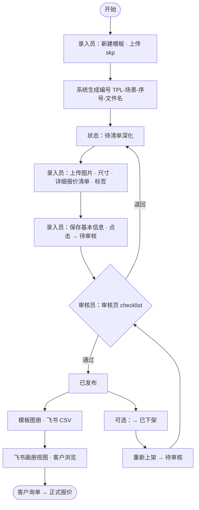
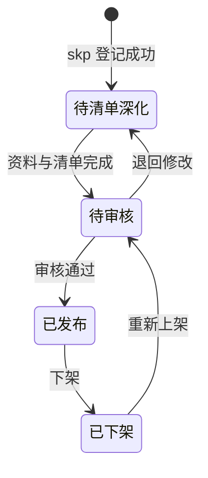
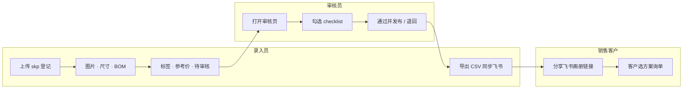
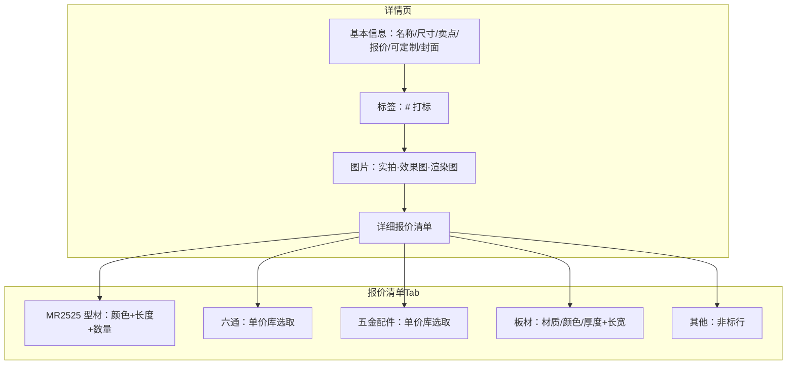
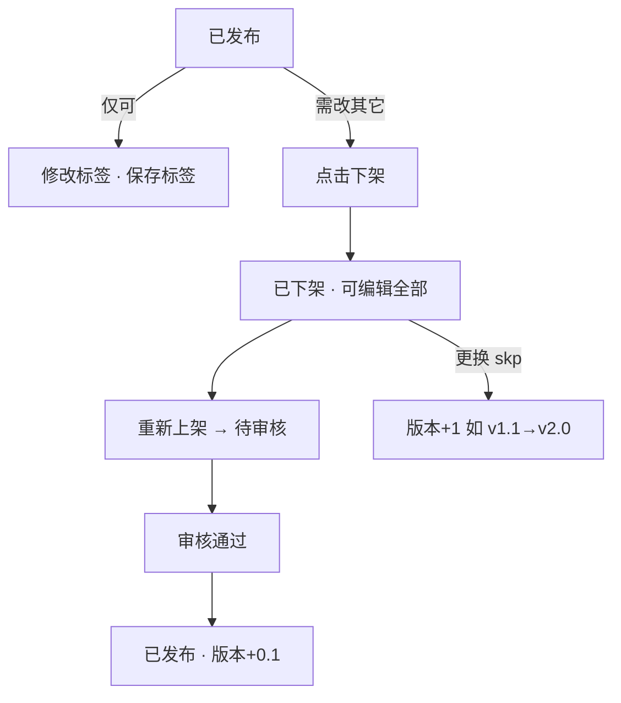
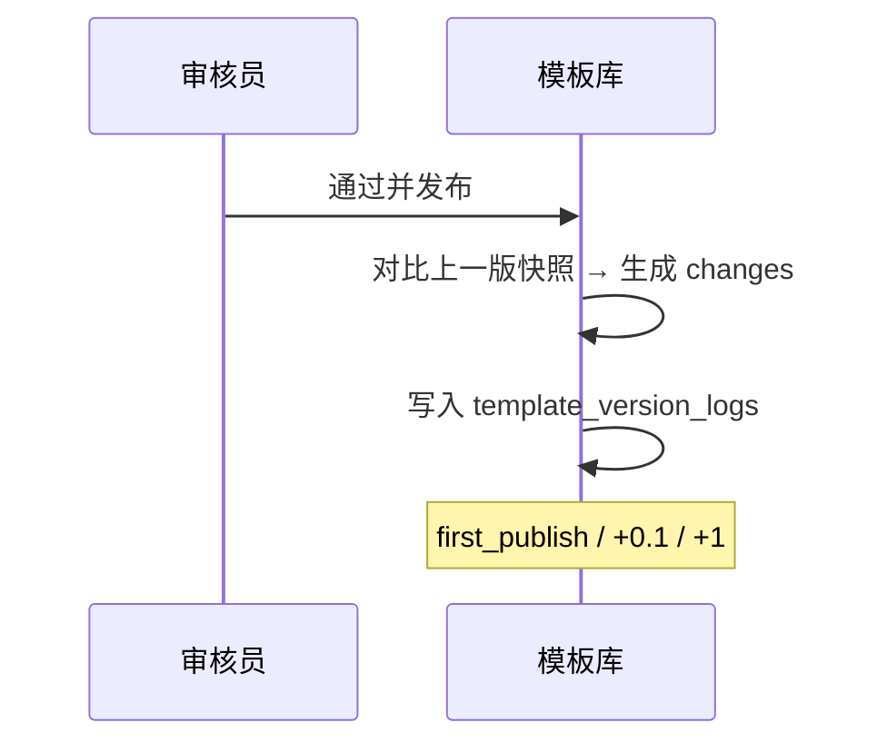
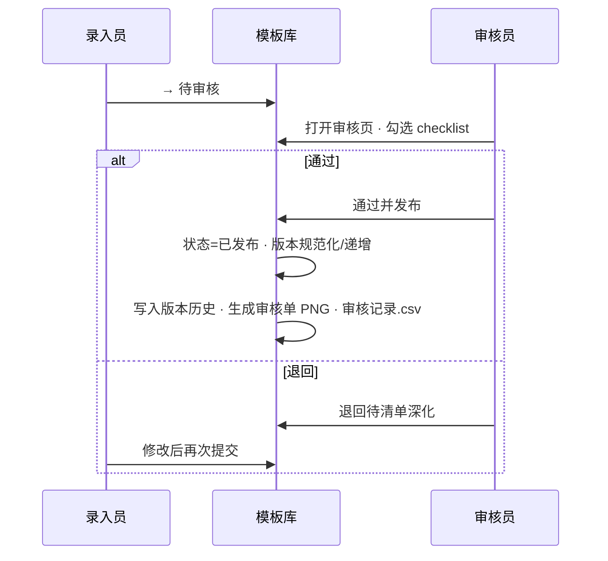
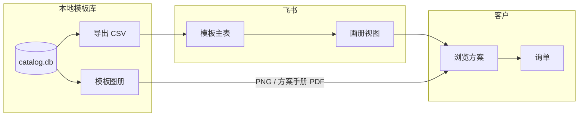
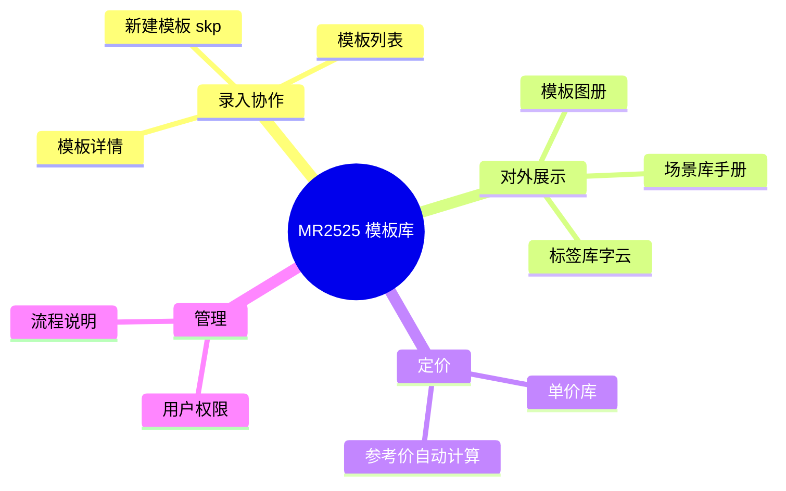
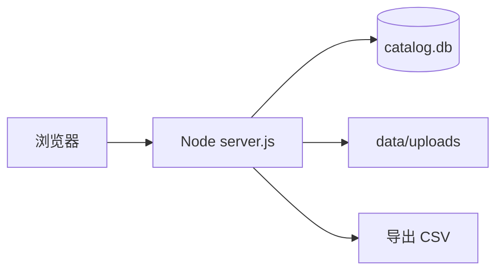

# 协作流程图 · 上手指南

> 最后更新：2026-06-04（版本历史、外包深化表单、单价库六通/五金图片）  
> 完整规范：[MR2525 模板库协作 SOP](MR2525模板库协作SOP.md)  
> 升级摘要：[UPGRADE-20260604](UPGRADE-20260604.md)  
> 系统内查看：侧栏 **流程说明**（含交互流程图）

本文档帮助新协作者 **5 分钟理解分工**，并按角色执行操作。细节口径（定价、皮肤、checklist）以 SOP 为准。

---

## 1. 五分钟上手（按角色）

| 角色 | 你能做什么 | 第一件事 |
|------|------------|----------|
| **管理员** | 维护单价库 / 用户；审核、下架、重新上架 | 单价库 → 确认型材公式、五金/板材单价 |
| **编辑** | 新建模板、补资料与 BOM、提交审核；导出 CSV | **新建模板** → 上传 skp → 进详情补全 |
| **只读** | 浏览列表、详情、图册、场景库、标签库 | **模板列表** → 筛选标签/场景 → 打开详情 |

**本地访问：** `http://localhost:3847`（坚果云目录 `npm start`）  
**强刷前端：** Ctrl+F5（侧栏底部有 UI 版本号）

---

## 2. 主流程（端到端）

**要点：**

- 已废除「待建模」；登记 skp 后直接进入 **待清单深化**（`pending_quote`）。
- **已发布** 除 **标签** 外不可编辑；须 **下架** 后再改，重新审核上架时版本 **+0.1**，更换 skp 时版本 **+1**。
- **已下架** 不可直接改回已发布；须 **重新上架 → 待审核 → 审核通过**（见 [模板列表 §7–§8](TEMPLATE-LIST-UPDATES.md)）。
- 参考价由系统按 BOM + 单价库 **自动计算**；录入员核对后保存。

---

## 3. 状态机

| 状态（界面） | 内部 key | 谁可推进 |
|--------------|----------|----------|
| 待清单深化 | `pending_quote` | 编辑：→ 待审核 |
| 待审核 | `pending_review` | 审核员：通过 / 退回 |
| 已发布 | `published` | 仅可改 **标签**；编辑可 **下架**；改其它须先下架 |
| 已下架 | `archived` | 编辑：重新上架 → 待审核（再发布后版本 **+0.1**） |

---

## 4. 分工泳道图

---

## 5. 录入员：详情页要填什么

| 区块 | 说明 | 文档 |
|------|------|------|
| 基本信息 | 分组保存；可定制为 chip | [DETAIL-BASIC-INFO-UPDATES](DETAIL-BASIC-INFO-UPDATES.md) |
| 标签 | `#` 搜索或创建；常用 Top5 | [TAG-LIB-UPDATES](TAG-LIB-UPDATES.md) |
| 型材 | 颜色在单价库维护，**不影响单价** | [PRICE-LIB-UPDATES](PRICE-LIB-UPDATES.md) §9 |
| 五金/板材 | 从单价库选；改价后已引用行自动同步 | [PRICE-LIB-UPDATES](PRICE-LIB-UPDATES.md) |
| 列表筛选 | 多标签 **交集** | [TEMPLATE-LIST-UPDATES](TEMPLATE-LIST-UPDATES.md) §10 |

**已发布时：** 上图除 **标签** 外的区块均不可编辑（见下节）。

---

## 6. 已发布：只读、下架与版本号

| 规则 | 说明 |
|------|------|
| 状态按钮 | 详情「状态推进」仅 **下架**（非「→ 已下架」） |
| 可编辑 | **仅标签**（`#` 打标 +「保存标签」） |
| 不可编辑 | 基本信息、图片、报价清单、封面、内部备注保存等 |
| 修改流程 | **下架** → 改内容 → **重新上架** → 待审核 → **通过并发布** |
| 版本 +0.1 | 非首次审核发布时自动递增次版本（`v1.0`→`v1.1`） |
| 版本 +1 | 下架后**再次上传 skp**（替换已有模型）递增主版本（`v1.1`→`v2.0`） |
| 版本字段 | 详情只读，由系统写入，不可手工改 |
| **版本历史** | 每次「通过并发布」写入一条记录；详情可查看变更摘要（见 §6.1） |

详见 [模板列表 §7](TEMPLATE-LIST-UPDATES.md)、[§12 版本历史](TEMPLATE-LIST-UPDATES.md#12-2026-06-04--版本历史)。

---

## 6.1 版本历史（审核发布时写入）

| 触发 | 版本 | 说明 |
|------|------|------|
| 首次发布 | → v1.0 | `first_publish` |
| 再发布（内容修订） | +0.1 | `re_publish_minor` |
| 再发布且换 skp | +1 | `re_publish_major` |

API：`GET /api/templates/:id/version-logs`

---

## 6.2 外包深化表单

| 操作 | 说明 |
|------|------|
| 导出 | 含基本信息、报价清单、标签；ZIP 附 `catalog.csv` |
| 导出空表 | `?empty=1`；已发布模板可仅导出空表 |
| 导入 | preview 校验 → apply 写入（须可编辑状态） |

详见 [DEEPENING-FORM-UPDATES](DEEPENING-FORM-UPDATES.md)。

---

## 6.3 单价库 · 六通 / 五金图片

| 项 | 说明 |
|----|------|
| 维护 | 单价库 → 六通 / 五金 Tab；添加时可选图片 |
| 列表 | 图片列：缩略图、拖拽上传、清除 |
| 范围 | **不含** 板材 |
| 联动 | 改图不同步到已引用模板；删条目清文件 |

详见 [PRICE-LIB-UPDATES §13](PRICE-LIB-UPDATES.md#13-2026-06-04--六通--五金图片)。

---

## 7. 审核发布

Checklist 项以系统 `meta.auditChecklist` 为准（编号、图片、BOM、参考价、可定制等）。

---

## 8. 对外交付

- **主编辑算价：** 本地库  
- **对外浏览：** 飞书画册 + 模板图册（展示图 PNG、**方案手册** PDF，对外脱敏 BOM）  
- **内部生产/采购：** 图册 **下载清单** CSV（对内/对外价、供应商、采购链接；须导出权限）；支持勾选 **批量下载**  
- 详见 [GALLERY-UPDATES](GALLERY-UPDATES.md)、[FEISHU-SETUP](FEISHU-SETUP.md)

### 8.1 模板图册下载（已发布）

| 操作 | 内容 | 权限 |
|------|------|------|
| 下载图片 | 合成展示图 PNG | 登录可读 |
| 下载手册 | 对外方案 PDF（`{编号}_手册.pdf`） | 登录可读 |
| 下载清单 | 内部 BOM CSV（`{编号}_清单.csv`） | `canExport` |
| 批量 | 顶栏全选/勾选 → 一键打包图片 zip / 手册 zip / 合并清单 csv | 清单需 `canExport` |

API：`GET /api/templates/:id/public-sheet.pdf`、`GET /api/templates/:id/internal-sheet.csv`、`GET /api/export/gallery-sheet?ids=`

---

## 9. 系统模块地图

---

## 10. 数据存储

| 内容 | 路径 |
|------|------|
| 数据库 | `data/catalog.db` |
| 模板附件 | `data/uploads/{模板编号}/` |
| 单价库图片 | `data/uploads/price-items/{nut\|hardware}/` |
| 审核存档 | `data/uploads/审核存档/` |
| 飞书模板 CSV | `data/feishu/*.csv` |

---

## 11. 关联文档索引

| 主题 | 文档 |
|------|------|
| **升级摘要 2026-06-04** | [UPGRADE-20260604.md](UPGRADE-20260604.md) |
| 协作 SOP 全文 | [MR2525模板库协作SOP.md](MR2525模板库协作SOP.md) |
| 已发布只读 / 下架 / 版本 | [TEMPLATE-LIST-UPDATES.md](TEMPLATE-LIST-UPDATES.md) §7、§12 |
| 外包深化表单 | [DEEPENING-FORM-UPDATES.md](DEEPENING-FORM-UPDATES.md) |
| 单价库 | [PRICE-LIB-UPDATES.md](PRICE-LIB-UPDATES.md) |
| 标签库 | [TAG-LIB-UPDATES.md](TAG-LIB-UPDATES.md) |
| 模板列表 | [TEMPLATE-LIST-UPDATES.md](TEMPLATE-LIST-UPDATES.md) |
| 详情基本信息 | [DETAIL-BASIC-INFO-UPDATES.md](DETAIL-BASIC-INFO-UPDATES.md) |
| 模板图册 | [GALLERY-UPDATES.md](GALLERY-UPDATES.md) |
| 场景库 | [SCENARIO-LIB-UPDATES.md](SCENARIO-LIB-UPDATES.md) |
| 飞书搭建 | [FEISHU-SETUP.md](FEISHU-SETUP.md) |
