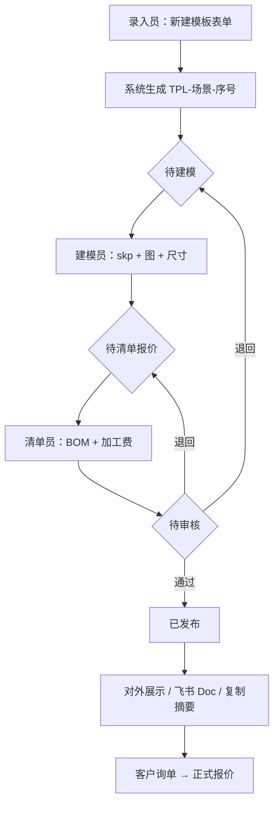
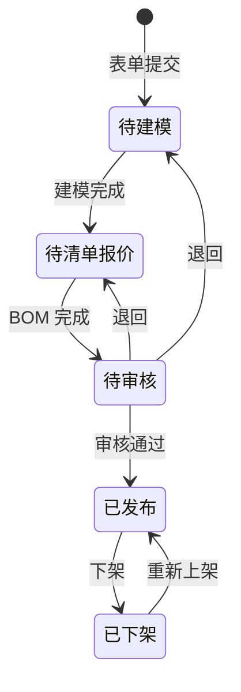
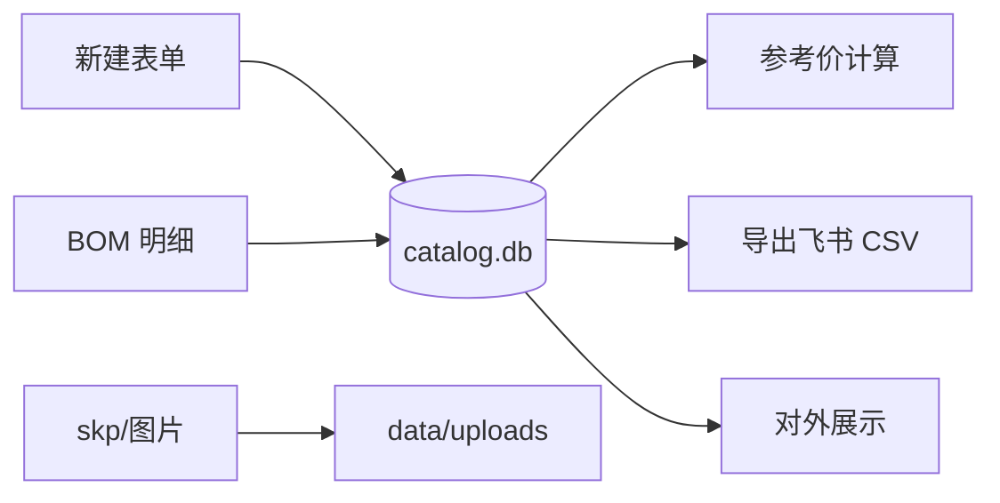
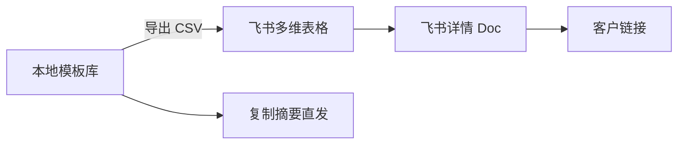

# 协作流程图

## 主流程

```mermaid
flowchart TD
    A[录入员：新建模板表单] --> B[系统生成 TPL-场景-序号]
    B --> C{待建模}
    C --> D[建模员：skp + 图 + 尺寸]
    D --> E{待清单报价}
    E --> F[清单员：BOM + 加工费]
    F --> G{待审核}
    G -->|通过| H[已发布]
    G -->|退回| C
    G -->|退回| E
    H --> I[对外展示 / 飞书 Doc / 复制摘要]
    I --> J[客户询单 → 正式报价]
```

## 状态机

```mermaid
stateDiagram-v2
    [*] --> 待建模: 表单提交
    待建模 --> 待清单报价: 建模完成
    待清单报价 --> 待审核: BOM 完成
    待审核 --> 已发布: 审核通过
    待审核 --> 待建模: 退回
    待审核 --> 待清单报价: 退回
    已发布 --> 已下架: 下架
    已下架 --> 已发布: 重新上架
```

## 数据流

```mermaid
flowchart LR
    Form[新建表单] --> DB[(catalog.db)]
    SKP[skp/图片] --> Uploads[data/uploads]
    BOM[BOM 明细] --> DB
    DB --> Price[参考价计算]
    DB --> CSV[导出飞书 CSV]
    DB --> Public[对外展示]
```

## 与飞书的关系

```mermaid
flowchart LR
    Local[本地模板库] -->|导出 CSV| Feishu[飞书多维表格]
    Feishu --> Doc[飞书详情 Doc]
    Doc --> Customer[客户链接]
    Local --> Customer2[复制摘要直发]
```

本地库是 **编辑与算价** 的主系统；飞书是 **对外展示与权限分享** 的扩展层。
